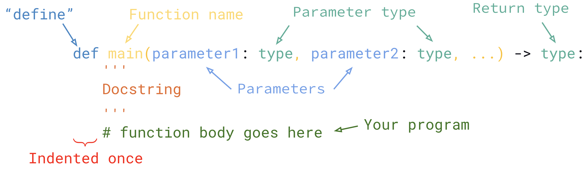

# 5.1 Intro to Functions & Function Parameters

## Functions
You can think of a function as a **subprogram** - a small program inside another program. Functions allows us to break our program into smaller parts, and make the program easier to understand.

For example, imagine taking a program you made from the `if` statements exercsises (LetterGrade.py). We can store all this code inside a function, give it a name, then we can use it anywhere we want inside our program by referring to the name we gave it.

Functions are time savers because they allow blocks of code to be run from many locations within the program without have to duplicate the code.

## Syntax


### Parts of a Function
* `def` - You must always define your function
* `function_name` - A function must always have a name
* `parameters` - Similar to variables, these are used inside the function
  * You can have as many parameters as you want
* `type`
  * **Parameters**: set the data type for the input in the function
  * **return**: set the data type for the return value (more on this in Lesson 5.2)
* `Docstring` - This is part of the Python Programming Style. A description of the function goes here (more on this in Lesson 5.4)
* `Body` - All code for the function goes in the body

## Terminology
1. **Function Definition** - The part that creates the function: `def function_name():`
2. **Formal Parameters** - A variable specified in the function definition to be used inside the function
3. **Arguments** - Value specified when function is called
4. **Calling/Invoking** - When we use the function

<span style="color:red">
<b>NOTE: The function name and parameter names MUST follow the same naming rules and conventions as variables</b>
</span>

## Parameters
* The parameter as it is defined as part of a method definition is called a **formal parameter**
* Parameters are variables that we use within the function. We don't know what the value will be (but we do know it's type)
  * We can use the variable assuming that it has a value when it is run.
* The value that is given to the function when it is called is known as an **argument**
* Parameters defined inside a function can only be used in the function itself

## Arguments
We've actually used arguments **many** times before. In every program you have written, you have used arguments. Where do you think we have used arguments?

## `pass`
Sometimes you have an idea of what you want for your function but you don't know what goes in it just yet, you can use the `pass` command:
```python
def function_name(parameter: type) --> type:
    pass
```

## Example #1
### Part (a) Create a function that will calculate the area of a rectangle.

Before:
```python
length = float(input("Enter the length (in cm): "))
width = float(input("Enter the width (in cm): "))

area = length * width

print(f"The area of the rectangle is: {area} cm^2")
```

With a function:
```python

```

### Part (b) Use your function by calling it
```

```

<span style="color:red">
<b>NOTE: You can only call functions AFTER it has been defined</b>
</span>

## Example #2
### Part (a) Create a function that will check if an integer is even, odd, or neither
Before:
```python
num = int(input("Enter a number: "))


```

With a function:
```python

```

## Why Use Functions?
- Saves time - you only need to code once
- Saves space - replace big calculations with one call to the function
- Reuse Code
- Easier error tracking/debugging - you can find and fix errors faster
- Maintainable Code - limit the number of changes to code when your program needs to be updated
- On a large project, different programmers can work on different functions